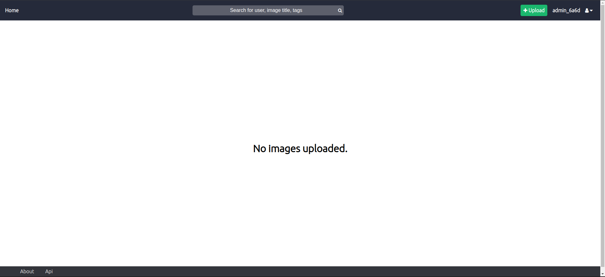
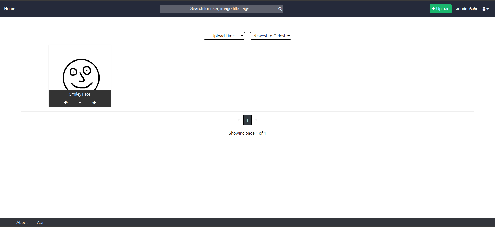
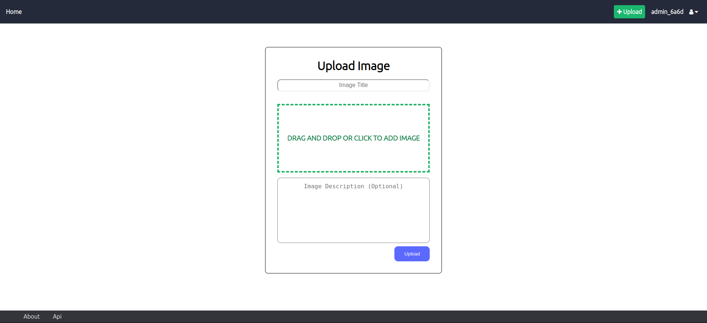
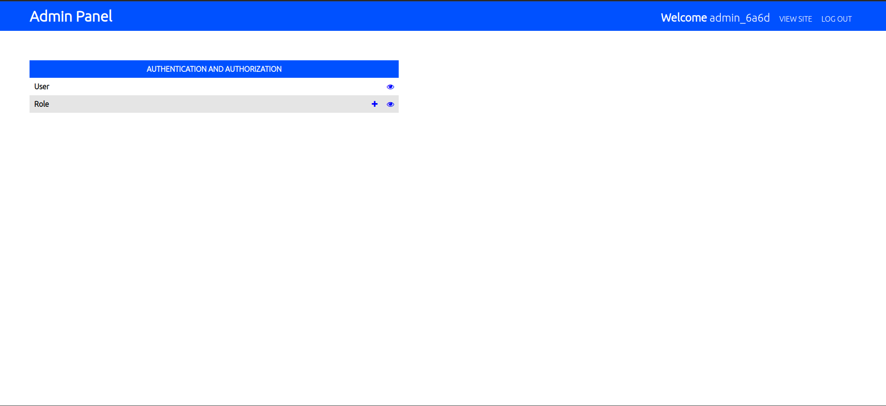

# Imager

Simple Image Sharing website written with Flask.

## Requirements
+ Python 3

## Setup
1. Install Postgres and it's dependecies (libpq-dev).
2. Create production database:
```
sudo su - postgres
psql
CREATE DATABASE <dbname>;
CREATE USER <user> WITH ENCRYPTED PASSWORD <pwd>;
GRANT ALL PRIVILEGES ON DATABASE <dbname> TO <user>;
```
3. Create testing database:
```
CREATE DATABASE <testing_dbname>;
CREATE USER <testing_user> WITH ENCRYPTED PASSWORD <testing_pwd>;
GRANT ALL PRIVILEGES ON DATABASE <testing_dbname> TO <testing_user>;
```
5. Install virtualenvwrapper.
6. Create virtualenv:
```
mkvirtualenv imager_env
```
3. Activate virtual env:
```
workon imager_env
```
4. Install Python libraries:
```
pip install -r requirements.txt
```
6. Create a .env file in the root of the project and add the following variables:
```
SECRET_KEY=<Generate Secret Key and add here, not to be shared>
FLASK_ENV=production
FLASK_DEBUG=False
SQLALCHEMY_DATABASE_URI=postgresql://<user>:<pwd>@<postgres_server_ip>:<port>/<dbname>
TEST_SQLALCHEMY_DATABASE_URI=postgresql://<testing_user>:<testing_pwd>@<postgres_server_ip>:<port>/<testing_dbname>
MAIL_SERVER="smtp.gmail.com"
MAIL_PORT=465
MAIL_USE_SSL=True
MAIL_USERNAME=<sender-email>
MAIL_PASSWORD=<email-password>
MAIL_DEBUG=1
TEST_EMAIL_CONFIG="<test-sender-email>
AUTHLIB_INSECURE_TRANSPORT=1
TESTING=False
```
7. Generate database tables:
```
flask db upgrade
```
8. Create a super user (won't require sending an email to activate account)
```
flask auth createsuperuser
```

## Running
To run the webapp, run the following:
```
sudo chmod +x run.sh
sh run.sh
```

## Screenshot Examples
### Front page (No image uploaded)


### Front page (Image uploaded)


### Upload picture page


### Admin page



